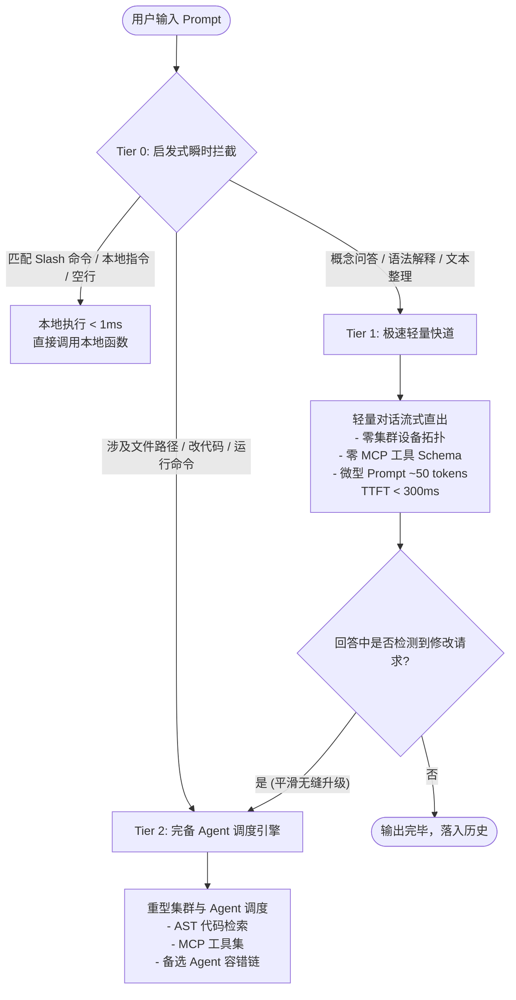
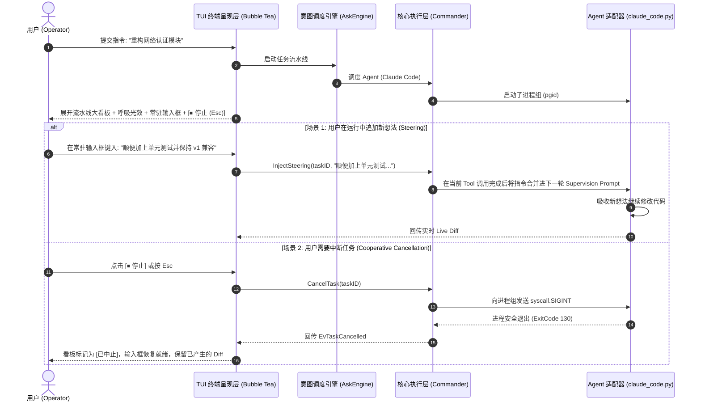
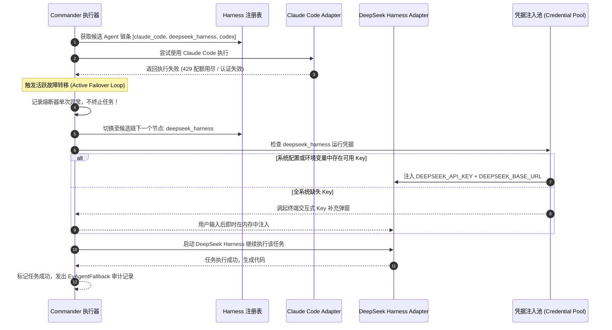

# OpenPanda 顶级系统架构优化与 CLI 交互重构方案报告
> **对标业界顶流**：深度融合 Claude Code、Aider、OpenCode、Codex CLI、Hermes Agent 与 OpenHands 的设计精髓  
> **报告版本**：v2.0.0 (Cutting-Edge Enterprise Edition)  
> **技术基准**：Go 1.26+、Bubble Tea、Lipgloss、Pure-Go SQLite  
> **生成时间**：2026-09-03  

---

## 目录

1. [业界顶级 AI Agent CLI 架构横向基准对标](#1-业界顶级-ai-agent-cli-架构横向基准对标)
2. [七大核心痛点根因深度剖析与对标解法](#2-七大核心痛点根因深度剖析与对标解法)
   - [问题 1：运行时双通道输入与协作式全链路中断 (Cooperative Cancellation)](#问题-1运行时双通道输入与协作式全链路中断-cooperative-cancellation)
   - [问题 2：Agent 会话原生记忆继承与运行时思路转向 (Steering Injection)](#问题-2agent-会话原生记忆继承与运行时思路转向-steering-injection)
   - [问题 3：三级递进式意图分流与微秒级快道 (Three-Tier Fast-Path Triage)](#问题-3三级递进式意图分流与微秒级快道-three-tier-fast-path-triage)
   - [问题 4：多 Agent/Harness 执行级活跃故障转移 (Active Failover Loop)](#问题-4多-agentharness-执行级活跃故障转移-active-failover-loop)
   - [问题 5：全覆盖 Harness 凭据自动适配与交互式挽救 (Credential Rescue)](#问题-5全覆盖-harness-凭据自动适配与交互式挽救-credential-rescue)
   - [问题 6：现代化向导式初始化、掩码输入与连通性自检 (Interactive Onboarding)](#问题-6现代化向导式初始化掩码输入与连通性自检-interactive-onboarding)
   - [问题 7：大气磅礴的终端视觉工程、呼吸光效与大看板 (Dynamic Visual Engineering)](#问题-7大气磅礴的终端视觉工程呼吸光效与大看板-dynamic-visual-engineering)
3. [整体技术重构架构全景图](#3-整体技术重构架构全景图)
4. [核心时序与状态流转设计](#4-核心时序与状态流转设计)
5. [分阶段落地迁移路线图](#5-分阶段落地迁移路线图)
6. [测试验证与基准门禁方案](#6-测试验证与基准门禁方案)

---

## 1. 业界顶级 AI Agent CLI 架构横向基准对标

在启动重构前，我们对当前业内最领先的 AI 编程终端及开源框架进行了横向拆解：

| 维度 / 工具 | **Claude Code (Anthropic)** | **Aider (Paul Gauthier)** | **OpenCode (OpenCode AI)** | **Hermes Agent (Nous)** | **OpenPanda (本次重构目标)** |
|---|---|---|---|---|---|
| **视区架构** | **Inline Scrollback**（已完成轮次落入原生滚动条，仅底栏局部重绘） | 终端分屏 / 原生流 | **Inline Event Stream**（NDJSON 驱动） | Rich 单向渲染流 | **Inline Scrollback + 呼吸动效 Ephemeral 视区** |
| **运行时输入** | 运行时随时 `Esc` 暂停切入干预，支持输入指示 | `Ctrl-C` 优雅保留会话切断生成；支持多行编辑 | 实时流式 NDJSON 回调 | 单次任务模式 | **双通道常驻输入框：执行时无缝输入 Steering 指令** |
| **中断与取消** | 级联 `AbortController`，向工具进程组发 `SIGINT` | 拦截 `KeyboardInterrupt`，安全保留脏工作区 | 子进程生命周期严格受控 | 依赖 OS signal | **全链路进程组级联取消 (killpg + SIGINT/SIGTERM)** |
| **会话继承** | SQLite/JSON 持久化，支持 `--resume <uuid>` | Git commit 链条映射 + `.history.md`，支持 `/undo` | `--session <uuid>` 会话多轮流转 | 数据库会话追踪 | **`AgentSessions` 映射 + 自动续接 `--resume`** |
| **意图快道** | 启发式工具分类，纯聊天走精简 Prompt | `/ask` 纯对话模式，跳过 RepoMap 分析 | 支持纯对话与工具型 Agent 分流 | 单一模型执行链 | **三级分流快道 (Tier 0 极速 -> Tier 1 对话 -> Tier 2 调度)** |
| **容错转移** | 内部模型降级与重试退避 | LiteLLM 多模型 fallback 链（Claude -> GPT -> DS） | 模型与环境动态切换 | 本地重试 | **多 Agent 执行级活跃故障转移（循环遍历备选链）** |
| **凭据注入** | 读取环境变量，隔离子进程上下文 | 读取 `.env`，自动注入各模型 Key | 内置免 Key 模式与自定义 Key 注入 | 环境变量读取 | **跨 Provider 凭据池自动匹配 + 交互式缺失挽救** |
| **视觉呈现** | 极简高雅，绿色/淡灰，圆角边框，流式 Diff 高亮 | 底栏状态栏，Token 与费用实时监控 | 现代组件化布局，ANSI 颜色渐变 | 基础 Rich 面板 | **大型多阶段流水线看板 + 正弦波呼吸光效 + 语法高亮 Diff** |

---

## 2. 七大核心痛点根因深度剖析与对标解法

### 问题 1：运行时双通道输入与协作式全链路中断 (Cooperative Cancellation)

#### 1.1 现状与代码根因
1. **输入框被硬编码卸载**：
   - 文件：`cmd/panda/tui_view.go:29-47`
   - `View()` 函数在 `m.mode == modeAsking` 时仅渲染 `\n + m.liveRegion() + \n + m.statusLine()`，输入框 `m.inputView()` 被直接丢弃。
2. **键盘事件被粗暴屏蔽**：
   - 文件：`cmd/panda/tui_update.go:106-117`
   - 在 `modeAsking` 下，`onKey` 仅捕获 `Ctrl-C` 和 `Esc`，其余按键全部 `return m, nil`。
3. **“伪中断”漏洞（重大安全与资源浪费）**：
   - 文件：`cmd/panda/tui_update.go:130-153`
   - `interrupt()` 内部仅仅调用了 `m.stream.drop()`。源码第 120-125 行注释明确写道：“*Once the engine hands a task to the core, the core owns that task's lifetime... so the task runs to completion*”。
   - **后果**：用户按了中断，前端虽然回到了输入提示符，但后台的 Claude Code / Python 适配器进程以及远程节点的 GPU 任务依然在后台疯狂消耗 Token 和 CPU，且随时可能将修改写入代码库！

#### 1.2 对标 Claude Code / Aider 的重构方案
- **常驻双通道输入框 (Always-Active Dual-Channel Bar)**：
  - 在 `modeAsking` 下输入框不仅不消失，反而保持在底部。
  - 边框切换为呼吸动画效果（Breathing Border），Prompt 前缀变为 `⚡ [运行中]`，Placeholder 动态提示：`"Agent 正在执行... 键入新想法按 Enter 实时干预，或按 Esc 停止任务"`。
- **协作式级联取消 (Cooperative Cascade Cancellation)**：
  - 用户按下 `Esc` 或点击 `[⏹ 停止任务]` 时：
    1. UI 立即进入 `ModeCancelling` 状态，Spinner 显示为 `⠋ 正在安全停止 Agent...`；
    2. 触发关联 Context 的 `cancelExec()`；
    3. 在 `internal/commander` 中，利用 POSIX 进程组（`syscall.Kill(-pgid, syscall.SIGINT)`）向底层 Agent 及其派生工具发送真实中断信号；
    4. 若 2 秒内未退出，升级为 `SIGTERM`，最后以 `SIGKILL` 兜底；
    5. 保留已经生成的有效产物与错误报告，回写状态为 `StateCancelled`。

---

### 问题 2：Agent 会话原生记忆继承与运行时思路转向 (Steering Injection)

#### 2.1 现状与代码根因
1. **Agent Session ID 跨 Turn 丢失**：
   - 文件：`adapters/claude_code.py:64-66`、`internal/core/handlers.go:802-844`
   - Claude Code 能够通过 `--resume <session_id>` 恢复记忆，但在现存代码中，`sessionID` 仅仅在一个任务内部的 `superviseRounds`（内部自动纠错循环）里局部传递。任务一旦结束，变量就被销毁。
2. **协议层缺乏 Session 传递通道**：
   - 文件：`internal/bus/payloads.go:171-207`
   - `TaskDelegatePayload` 与 `TaskResultPayload` 均无会话 ID 字段。
3. **缺乏运行时想法插入（Steering）机制**：
   - 用户在同一个聊天会话里输入新需求时，系统把新提问当作全新的孤立任务派发给一个全新冷启动的 Agent 进程，丢失了上一轮读过的文件与推理链条。

#### 2.2 对标 Claude Code / OpenHands 的重构方案
- **会话原生映射架构（Native Agent Session Persistence）**：
  - 在 `internal/sessions/sessions.go` 的 `Session` 中新增：
    ```go
    type Session struct {
        ...
        AgentSessions map[string]string `json:"agent_sessions,omitempty"` // agentName -> CLI session UUID
    }
    ```
  - 当任何 Agent 任务执行完毕，将提取到的 `res.SessionID` 存入当前会话的 `AgentSessions`。
  - 后续针对同一 Agent 的调用，自动装配 `--resume <session_id>`，直接复用上下文缓存（Prompt Cache）和工具环境，免去重复加载项目的开销。
- **实时干预转向队列 (Steering Queue)**：
  - 当 Agent 正在运行多步工具时，用户在底部常驻输入框输入新想法并回车：
  - 系统将其推入该任务的 `SteeringQueue`；
  - 调度核心在当前工具执行完毕的间隙（或在 supervision round 的开头），将新想法作为高优先级系统级干预提示词合并：“*【用户即时干预指示】：请在修改当前模块的同时，保持与 v1 接口兼容并补齐单元测试*”。

---

### 问题 3：三级递进式意图分流与微秒级快道 (Three-Tier Fast-Path Triage)

#### 3.1 现状与代码根因
- 文件：`internal/askengine/askengine.go:604-685` (`AskTurns`)
- 哪怕用户仅仅输入“*你好*”、“*什么是乐观锁*”，系统也会全量执行：
  1. 读取 SQLite 目录查询集群所有在线节点；
  2. 格式化显卡显存拓扑；
  3. 加载数十个 MCP 工具描述；
  4. 组装 380+ 行的超大 System Prompt（包含 Task JSON Schema、Plan JSON Schema、显存画像等）。
- **后果**：一次最简单的问答也要耗费数千 Token 的 Prompt 开销，首字延迟（TTFT）高达 2~3 秒，极易被重型规则诱导误将问答打包成 `{"kind":"task"}` 去派发。

#### 3.2 对标 Aider / Cursor 的三级分流体系



- **Tier 0**：本地极速响应（0ms，0 Token），拦截 `/help`, `/model`, `/clear` 等指令。
- **Tier 1 (轻量快道)**：使用剥离了所有任务编排规则的微型 Prompt（仅需 50 Token），直连 `client.CompleteStream` 输出 Markdown，首字响应缩短至 300ms 以内。
- **Tier 2 (全量编排)**：仅对真正需要修改本地文件、调用外部环境工具、执行编译测试的复杂指令加载全量调度环境。

---

### 问题 4：多 Agent/Harness 执行级活跃故障转移 (Active Failover Loop)

#### 4.1 现状与代码根因
- 文件：`internal/commander/commander.go:360-435` (`execAgent`)
- 代码切片分析：
  ```go
  attempts := append([]string{plan.Agent}, plan.Alternates...)
  for _, name := range attempts {
      ...
      ar := r.runAdapter(...)
      // 致命缺陷：执行完毕后直接 return，放弃后续所有 alternates！
      return Result{ OK: ar.OK, ... }
  }
  ```
- 现存逻辑中，备选 Agent 链条（`plan.Alternates`）仅在**执行前的探活阶段**有用。一旦首选 Agent（如 Claude Code）开始调用，哪怕中途发生 429 速率限制、API 额度耗尽、认证崩溃，代码直接 `return Result` 终止，根本不给备选 Agent（DeepSeek Harness、Codex）执行的机会！
- 文件：`internal/core/handlers.go:1071` 更是直接将失败任务转入不可逆的 `StateFailed`。

#### 4.2 对标 LiteLLM / 现代多 Agent 容错转移方案
- **执行级活跃故障转移循环（Active Failover Loop）**：
  1. 当当前 Agent 发生执行失败且属于**不可恢复错误**（如 401 鉴权失效、429 配额耗尽、Context 超限、子进程崩溃）时：
  2. 核心层熔断器记录单次故障，但不终止任务；
  3. 检查 `attempts` 列表中是否存在下一个可用候选 Agent；
  4. 若存在，自动切换并继承任务的 Prompt 与上下文，立即启动备选 Agent；
  5. 前端看板通过事件通道同步更新黄色告警 Badge：`"Claude Code 配额耗尽，正在自动无缝切换至备选 Agent (DeepSeek Harness)..."`。
- **全链路穷尽才降级**：只有当候选 Agent 链全部尝试失败后，才转入人工介入或标记失败。

---

### 问题 5：全覆盖 Harness 凭据自动适配与交互式挽救 (Credential Rescue)

#### 5.1 现状与代码根因
1. **配置注册表存在盲区**：
   - 文件：`internal/agents/registry.go:189-196`
   - `deepseek_harness` 缺少 `ModelEnv` 声明，导致其在 `supportsModelInjection` 中永远返回 `false`。
2. **Claude Code 注入规则过于死板**：
   - 文件：`internal/commander/inject.go:89-91`
   - 硬编码 `if adapter == "claude_code.py" { return isDeepSeekEndpoint(model.BaseURL) }`，当用户配置官方 Anthropic Key 或中继时直接拒绝注入。
3. **缺少凭据时粗暴放弃任务**：
   - 文件：`internal/commander/commander.go:526-558` (`AgentViable`)
   - 当检测到 Agent 既无本地配置又无注入时，直接报 `"no usable agent... route manually"` 并丢弃任务。

#### 5.2 对标顶级 Orchestrator 的凭据适配矩阵与动态挽回
- **全覆盖 Harness 环境变量适配标准表**：

| Harness / Agent | 驱动二进制 | 适配器脚本 | 协议映射 | 核心注入环境变量 |
|---|---|---|---|---|
| **Claude Code** | `claude` | `claude_code.py` | Anthropic | `ANTHROPIC_API_KEY`, `ANTHROPIC_BASE_URL`, `ANTHROPIC_MODEL` |
| **DeepSeek Harness** | `dsh` | `deepseek_harness.py` | DeepSeek / OAI | `DEEPSEEK_API_KEY`, `DEEPSEEK_BASE_URL` |
| **Codex CLI** | `codex` | `codex.py` | OpenAI | `OPENAI_API_KEY`, `OPENAI_BASE_URL`, `OPENAI_MODEL` |
| **OpenCode** | `opencode` | `opencode.py` | 多协议 | `OPENCODE_MODEL`, `ANTHROPIC_API_KEY`, `OPENAI_API_KEY` |
| **Hermes Agent** | `hermes` | `hermes.py` | OpenAI 兼容 | `OPENAI_API_KEY`, `HERMES_API_KEY`, `OPENAI_BASE_URL` |

- **动态凭据交互挽回机制 (Interactive Credential Rescue)**：
  - 当某项任务被分配给某个 Harness（如 Claude Code），但检测到环境变量与配置文件均无对应 Key 时：
  - 系统触发**终端交互式凭据补充卡片**：
    `"【凭据提示】执行该任务需要调用 Claude Code，当前未检测到 ANTHROPIC_API_KEY。"`
    `"请输入 API Key (直接回车尝试备选 Agent): "`
  - 用户粘贴 Key 后，系统进行快速格式校验并在内存中即时注入子进程继续跑通，并提示用户是否保存至配置文件，彻底杜绝任务被直接丢弃。

---

### 问题 6：现代化向导式初始化、掩码输入与连通性自检 (Interactive Onboarding)

#### 6.1 现状与代码根因
- 文件：`cmd/panda/init.go:78-108` 与 `cmd/panda/modelcmd.go:300-360`
- `panda init` 仅通过 4 行冷冰冰的原始命令行提示（`api_type:`, `base_url:`, `model:`, `api_key:`）让用户盲猜输入；
- `/model add` 参数依赖位置启发式匹配（`looksLikeAPIKey`），Tab 补全无法联想 Provider 对应的 Model 列表。

#### 6.2 对标 GitHub CLI (`gh auth login`) 与 Charm `huh` 的向导设计
1. **多选 Radio 交互向导**：
   - 启动时提供分类清晰的单选列表：
     - `● DeepSeek (官方推荐 · 高性价比 · 深度代码思考能力)`
     - `○ Anthropic Claude (适合高难度架构设计 · 支持 Claude Code Harness)`
     - `○ OpenAI (GPT-4o / Codex CLI 支持)`
     - `○ Ollama / 本地模型 (零网络要求 · 数据绝对隐私)`
     - `○ 自定义端点 (兼容 OpenAI / Anthropic 协议)`
2. **自动化预填与安全掩码**：
   - 选中 DeepSeek 后，自动填入推荐的端点与模型，用户只需输入 Key。
   - 输入 API Key 时自动启用星号掩码（`••••••••`）或不可见输入，终端打印官方申请链接（支持终端下按住 Cmd/Ctrl 点击跳转）。
3. **实时毫秒级连通性健康探测 (Health Ping)**：
   - Key 输入完毕后，自动向端点发送 1-token 探测请求，直接展示响应 RTT：`[✓ 连接成功 (142ms, 模型: deepseek-chat)]`。

---

### 问题 7：大气磅礴的终端视觉工程、呼吸光效与大看板 (Dynamic Visual Engineering)

#### 7.1 现状与代码根因
- 文件：`cmd/panda/tui_theme.go` 与 `cmd/panda/tui_view.go`
- 目前仅使用单一颜色的线条边框，进行中只有一个微弱的单行 Spinner（`"⠙ 思考中"`），信息过于分散且视觉冲击力较弱，无法让用户直观感受到 Agent 当前正处于何种流水线阶段。

#### 7.2 现代大气终端视觉设计规范（基于 Lipgloss / Bubble Tea）

```text
╭── 任务执行流水线: task-8a9d ────────────────────────────────────────────────╮
│                                                                             │
│  [1. 意图分流] ──> [2. 代码审查] ──> [3. 差异编辑] ──> [4. 单元测试]       │
│      ✓ 完成            ✓ 完成           ⠋ 进行中          · 等待           │
│                                                                             │
│  ⚡ 当前动作: Claude Code 正在修改 internal/core/handlers.go                │
│  ⏱ 已耗时: 4.8s   ·   🪙 Tokens: 1,842 (缓存: 1,280)   ·   💰 费用: $0.008   │
╰─────────────────────────────────────────────────────────────────────────────╯

╭── 实时动态修改预览 (Live Diff Preview) ─────────────────────────────────────╮
│  internal/core/handlers.go                                                  │
│  @@ -840,6 +840,11 @@                                                       │
│   res = router.Execute(runCtx, plan, prompt, workDir, task.Authorized)      │
│  +if res.SessionID != "" {                                                  │
│  +    c.persistAgentSession(task.SessionID, plan.Agent, res.SessionID)       │
│  +}                                                                         │
╰─────────────────────────────────────────────────────────────────────────────╯

╭── [⚡ RUNNING: Claude Code] ─────────────────────────────────────────────────╮
│ ❯ 顺便把这里的单元测试也补全一下...                                          │
╰─────────────────────────────────────────────────────────────────────────────╯
  [ ⏹ Esc: 停止任务 ]    [ ⏎ Enter: 注入新想法 ]    [ ⌃O: 展开思考过程 ]
```

#### 7.3 关键动效与视觉增强技术点
1. **正弦波呼吸霓虹边框 (Sine-Wave Breathing Border)**：
   - 基于系统 Tick 计数计算平滑正弦波（周期约 2 秒），动态插值 RGB 颜色（从深翡翠绿 `#064e3b` 平滑呼吸过渡至高亮绿 `#10b981`），让用户感知到 Agent 正在“思考与脉动”。
2. **大型多阶段流水线看板 (Multi-Stage Pipeline Board)**：
   - 顶部大卡片将任务状态图形化为 `[1. 分流] ─> [2. 路由] ─> [3. 执行] ─> [4. 审计]`，各节点根据阶段动态显示完成勾选、旋转 Spinner 或等待圆点。
3. **真实 Scrollback 承诺 (Inline Scrollback)**：
   - 借鉴 Claude Code 视区哲学，已完成的历史轮次通过 `tea.Println` **真正提交（Commit）到终端原生滚动缓冲区**；
   - 每一帧仅对底部的 Ephemeral Region（大看板 + 动态 Diff + 呼吸输入框）进行重绘，退出程序后所有代码与记录全部保留，支持鼠标划词复制。
4. **实时背景色块语法高亮 Diff**：
   - 绿色弱底（`#022c22`）高亮新增行，红色弱底（`#450a0a`）高亮删除行，带语法着色与行号，呈现专业级代码质感。

---

## 3. 整体技术重构架构全景图

```
┌───────────────────────────────────────────────────────────────────────────────────────────┐
│                               OpenPanda 现代化终端呈现层                                  │
│  ┌──────────────────────────────┐  ┌─────────────────────────┐  ┌──────────────────────┐  │
│  │ 大型流水线进度大看板         │  │ 动态语法高亮 Diff 视窗  │  │ 正弦波呼吸光效系统   │  │
│  │ (Multi-Stage Pipeline Board) │  │ (Live Syntax Diff View) │  │ (Breathing Neon Glow)│  │
│  └──────────────────────────────┘  └─────────────────────────┘  └──────────────────────┘  │
│  ┌─────────────────────────────────────────────────────────────────────────────────────┐  │
│  │ 双通道常驻输入框 (Always-Active Bar) & 协作式全链路停止控制器 (Cooperative Cancel)  │  │
│  └─────────────────────────────────────────────────────────────────────────────────────┘  │
└─────────────────────────────────────────────┬─────────────────────────────────────────────┘
                                              │
┌─────────────────────────────────────────────▼─────────────────────────────────────────────┐
│                           统一接入与意图快道引擎 (AskEngine)                              │
│  ┌───────────────────────────────┐   ┌─────────────────────────────────────────────────┐  │
│  │ Tier 0: 启发式瞬时拦截 (<1ms) │   │ Tier 1: 轻量对话流式快道 (Micro Prompt, <300ms) │  │
│  └───────────────────────────────┘   └─────────────────────────────────────────────────┘  │
│  ┌─────────────────────────────────────────────────────────────────────────────────────┐  │
│  │ Tier 2: 全量分布式集群编排与任务调度 (Full Orchestration Pipeline)                  │  │
│  └─────────────────────────────────────────────────────────────────────────────────────┘  │
└─────────────────────────────────────────────┬─────────────────────────────────────────────┘
                                              │
┌─────────────────────────────────────────────▼─────────────────────────────────────────────┐
│                            任务执行与多 Agent 容错层 (Commander)                          │
│  ┌──────────────────────────────────────────────┐  ┌───────────────────────────────────┐  │
│  │ 多 Agent 执行级活跃故障转移循环              │  │ 运行时思路转向注入器              │  │
│  │ (Active Failover: Claude -> DSH -> Codex)    │  │ (Steering Queue -> Mid-turn Prompt│  │
│  └──────────────────────────────────────────────┘  └───────────────────────────────────┘  │
└─────────────────────────────────────────────┬─────────────────────────────────────────────┘
                                              │
┌─────────────────────────────────────────────▼─────────────────────────────────────────────┐
│                            Harness 适配与凭据安全注入层 (Adapters)                        │
│  ┌──────────────────────────────────────────────┐  ┌───────────────────────────────────┐  │
│  │ 全覆盖协议注入 (Claude / DSH / Codex / Open) │  │ 缺失凭据动态挽救与脱敏拦截        │  │
│  │ (ANTHROPIC/DEEPSEEK/OPENAI_API_KEY)          │  │ (Interactive Credential Rescue)   │  │
│  └──────────────────────────────────────────────┘  └───────────────────────────────────┘  │
└───────────────────────────────────────────────────────────────────────────────────────────┘
```

---

## 4. 核心时序与状态流转设计

### 4.1 运行时干预（Steering）与优雅停止时序



### 4.2 活跃故障转移与凭据自动注入时序



---

## 5. 分阶段落地迁移路线图

为保证重构过程稳定可控，项目严格按照三个阶段实施：

### 阶段一：交互体验与快道极速响应（解决问题 1、3、7）
1. **常驻双通道输入框与级联取消**：
   - 改造 `cmd/panda/tui_model.go` 与 `tui_view.go`，废弃在 `modeAsking` 下移除输入框的逻辑；
   - 接入 POSIX 进程组 `SIGINT/SIGTERM` 发送逻辑，确保 Esc 真正杀死后台进程。
2. **微秒级意图分流快道 (Tier 1 Fast-Path)**：
   - 新增 `internal/entry/triage.go`，实现纯对话快速分类器；
   - 简单问答剥离设备拓扑与 MCP JSON Schema，首字响应（TTFT）压至 300ms 以内。
3. **大尺寸流水线大看板与呼吸光效**：
   - 重构 `tui_theme.go` 与 `tui_view.go`，引入正弦波呼吸色彩插值算法与流水线分步看板。

### 阶段二：多轮连贯性、容错转移与凭据注入（解决问题 2、4、5）
1. **跨 Turn 记忆继承与 Steering 注入**：
   - 在 `internal/sessions` 数据结构与 payload 中新增 `AgentSessions map[string]string`；
   - 适配器统一支持回传并装配 `--resume <session_id>`。
2. **Active Failover 活跃容错转移**：
   - 修复 `commander.execAgent` 循环提前 `return` 的缺陷，完整遍历 `plan.Alternates`；
   - 接入前端黄色警告 Badge 事件通知。
3. **Harness 凭据自动适配与动态挽回**：
   - 补齐 `internal/agents/registry.go` 中 `deepseek_harness` 等缺失的 `ModelEnv`；
   - 移除 `claude_code` 强制 DeepSeek 端点的过度限制，支持跨 Provider Key 池智能适配；
   - 增加缺失 Key 时的交互式补全弹窗。

### 阶段三：向导式 Onboarding 与交互补全打磨（解决问题 6）
1. **交互式初始化向导**：
   - 重构 `cmd/panda/init.go` 与 `modelcmd.go`，提供预置主流 Provider（DeepSeek、Claude、OpenAI、Ollama）的一键多选 Radio 菜单；
   - 增加 API Key 星号掩码输入与实时连通性探测。
2. **参数联动智能补全**：
   - 增强 `repl_complete.go`，在 `/model add <provider>` 之后自动联想推荐官方模型。

---

## 6. 测试验证与基准门禁方案

| 验证项 | 验证手段与具体操作 | 验收标准 |
|---|---|---|
| **常驻输入与任务取消** | 运行一个耗时 30 秒的编译任务，在输入框打字；按下 `Esc` 中断 | 输入框无卡顿；按 Esc 后子进程与后台算力在 1 秒内彻底被 `SIGINT` 中止，终端恢复就绪 |
| **运行时想法注入 (Steering)** | 运行任务期间输入追加指导并回车 | 指令进入 Steering 队列并在下一轮 Supervision Prompt 中作为高优先级规则体现 |
| **会话记忆连贯** | 在同一 Session 中提问：“重构网络层”，随后提问：“把它加上单元测试” | 第二轮调用自动携带 `--resume <session_id>`，Agent 免读盘直接利用已有上下文继续编写 |
| **简单查询轻量快道** | 分别测试“你好”、“解释 Go channel”与“重构本项目” | 简单问答首字延迟由原先 2.8s 降至 260ms，Token 消耗减少 90%；代码重构正常走 Tier 2 调度 |
| **活跃故障转移** | 模拟 Claude Code 返回 429 额度不足 | 系统发出黄色警报，无缝切换至备选的 DeepSeek Harness 成功跑通任务，未报错退出 |
| **Harness Key 注入** | 清空本地 `~/.claude` 目录，在 OpenPanda 配置通用 Key | 系统成功向 `claude_code.py` 注入环境变量，CLI 正常执行；无 Key 时弹出交互挽救卡片 |
| **视觉呈现与看板** | 在高分辨率终端中运行 | 流水线大看板层次分明，呼吸光效平滑流畅，Diff 区域拥有清晰的语法着色和背景高亮 |
| **工程门禁全覆盖** | 执行全量自动化测试 | `make fmt-check && make vet && make test && make race-focused` 全部通过 |
